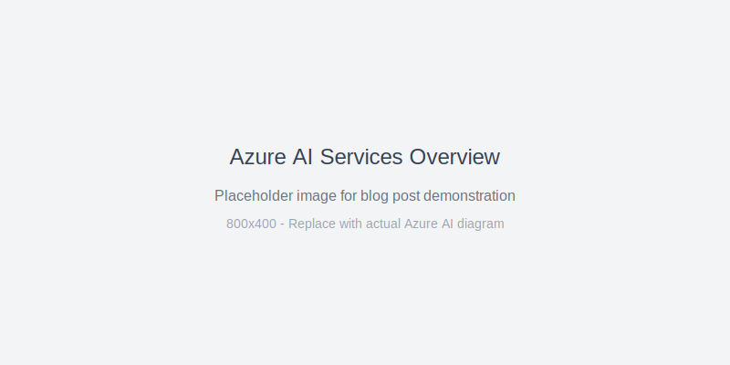

# Azure AI Services: A Practical Guide for Developers

Microsoft's Azure AI Services provide powerful, pre-built AI capabilities that developers can integrate into applications without deep machine learning expertise. This guide explores the most valuable services with practical implementation examples.



## Overview of Azure AI Services

Azure AI Services are cloud-based APIs that provide AI capabilities across several domains:

- **Vision Services**: Analyze images and videos
- **Language Services**: Understand and generate text
- **Speech Services**: Convert speech to text and vice versa
- **Decision Services**: Make intelligent recommendations

## Computer Vision API

The Computer Vision API can analyze images and videos to extract valuable information. Here's what the Azure portal looks like when setting up these services:


### Image Analysis

The Computer Vision API can analyze images and extract valuable information:

```typescript
import { ComputerVisionClient } from '@azure/cognitiveservices-computervision';
import { ApiKeyCredentials } from '@azure/ms-rest-js';

const client = new ComputerVisionClient(
  new ApiKeyCredentials({
    inHeader: { 'Ocp-Apim-Subscription-Key': process.env.AZURE_CV_KEY }
  }),
  process.env.AZURE_CV_ENDPOINT
);

async function analyzeImage(imageUrl: string) {
  const analysis = await client.analyzeImage(imageUrl, {
    visualFeatures: ['Categories', 'Description', 'Tags', 'Objects', 'Faces']
  });
  
  return {
    description: analysis.description?.captions?.[0]?.text,
    tags: analysis.tags?.map(tag => tag.name),
    objects: analysis.objects?.map(obj => ({
      name: obj.object,
      confidence: obj.confidence,
      rectangle: obj.rectangle
    }))
  };
}
```

### OCR (Optical Character Recognition)

Extract text from images with high accuracy:

```typescript
async function extractTextFromImage(imageUrl: string) {
  const readResult = await client.read(imageUrl);
  const operationId = readResult.operationLocation?.split('/').pop();
  
  // Poll for results
  let result;
  do {
    await new Promise(resolve => setTimeout(resolve, 1000));
    result = await client.getReadResult(operationId!);
  } while (result.status === 'running');
  
  return result.analyzeResult?.readResults
    ?.flatMap(page => page.lines)
    ?.map(line => line.text)
    ?.join(' ');
}
```

## Language Understanding (LUIS)

### Intent Recognition

Build conversational AI that understands user intentions:

```typescript
import { LUISRuntimeClient } from '@azure/cognitiveservices-luis-runtime';

const luisClient = new LUISRuntimeClient(
  new ApiKeyCredentials({
    inHeader: { 'Ocp-Apim-Subscription-Key': process.env.LUIS_KEY }
  }),
  process.env.LUIS_ENDPOINT
);

async function getIntentFromText(utterance: string) {
  const prediction = await luisClient.prediction.getSlotPrediction(
    process.env.LUIS_APP_ID!,
    'production',
    { query: utterance }
  );
  
  return {
    topIntent: prediction.prediction?.topIntent,
    confidence: prediction.prediction?.intents?.[prediction.prediction.topIntent!]?.score,
    entities: prediction.prediction?.entities
  };
}
```

### Example LUIS Application

```json
{
  "intents": [
    {
      "name": "BookFlight",
      "examples": [
        "Book a flight to New York",
        "I want to fly to Seattle tomorrow",
        "Reserve a ticket to London"
      ]
    },
    {
      "name": "GetWeather",
      "examples": [
        "What's the weather like in Paris?",
        "Will it rain tomorrow?",
        "Show me the forecast for this weekend"
      ]
    }
  ],
  "entities": [
    {
      "name": "Location",
      "type": "geographyV2"
    },
    {
      "name": "DateTime",
      "type": "datetimeV2"
    }
  ]
}
```

## Text Analytics

### Sentiment Analysis

Understand the emotional tone of text:

```typescript
import { TextAnalyticsClient } from '@azure/ai-text-analytics';

const textClient = new TextAnalyticsClient(
  process.env.TEXT_ANALYTICS_ENDPOINT!,
  new ApiKeyCredentials({
    inHeader: { 'Ocp-Apim-Subscription-Key': process.env.TEXT_ANALYTICS_KEY }
  })
);

async function analyzeSentiment(texts: string[]) {
  const results = await textClient.analyzeSentiment(texts);
  
  return results.map(result => ({
    text: result.id,
    sentiment: result.sentiment,
    confidence: result.confidenceScores,
    sentences: result.sentences.map(sentence => ({
      text: sentence.text,
      sentiment: sentence.sentiment,
      confidence: sentence.confidenceScores
    }))
  }));
}
```

### Key Phrase Extraction

Extract important phrases from text:

```typescript
async function extractKeyPhrases(texts: string[]) {
  const results = await textClient.extractKeyPhrases(texts);
  
  return results.map(result => ({
    id: result.id,
    keyPhrases: result.keyPhrases,
    warnings: result.warnings
  }));
}
```

## Speech Services

### Speech-to-Text

Convert audio to text with high accuracy:

```typescript
import { SpeechConfig, AudioConfig, SpeechRecognizer } from 'microsoft-cognitiveservices-speech-sdk';

function createSpeechRecognizer() {
  const speechConfig = SpeechConfig.fromSubscription(
    process.env.SPEECH_KEY!,
    process.env.SPEECH_REGION!
  );
  
  const audioConfig = AudioConfig.fromDefaultMicrophoneInput();
  return new SpeechRecognizer(speechConfig, audioConfig);
}

async function recognizeSpeech(): Promise<string> {
  return new Promise((resolve, reject) => {
    const recognizer = createSpeechRecognizer();
    
    recognizer.recognizeOnceAsync(result => {
      if (result.reason === ResultReason.RecognizedSpeech) {
        resolve(result.text);
      } else {
        reject(new Error(`Speech recognition failed: ${result.errorDetails}`));
      }
      recognizer.close();
    });
  });
}
```

### Text-to-Speech

Generate natural-sounding speech from text:

```typescript
import { SpeechSynthesizer, SpeechConfig, AudioConfig } from 'microsoft-cognitiveservices-speech-sdk';

async function synthesizeSpeech(text: string, voiceName: string = 'en-US-JennyNeural') {
  const speechConfig = SpeechConfig.fromSubscription(
    process.env.SPEECH_KEY!,
    process.env.SPEECH_REGION!
  );
  
  speechConfig.speechSynthesisVoiceName = voiceName;
  
  const audioConfig = AudioConfig.fromDefaultSpeakerOutput();
  const synthesizer = new SpeechSynthesizer(speechConfig, audioConfig);
  
  return new Promise<void>((resolve, reject) => {
    synthesizer.speakTextAsync(
      text,
      result => {
        if (result.reason === ResultReason.SynthesizingAudioCompleted) {
          resolve();
        } else {
          reject(new Error(`Speech synthesis failed: ${result.errorDetails}`));
        }
        synthesizer.close();
      },
      error => {
        synthesizer.close();
        reject(error);
      }
    );
  });
}
```

## Real-World Implementation Example

Here's a complete example that combines multiple AI services:

```typescript
class AIAssistant {
  private visionClient: ComputerVisionClient;
  private textClient: TextAnalyticsClient;
  private speechConfig: SpeechConfig;

  constructor() {
    this.visionClient = new ComputerVisionClient(
      new ApiKeyCredentials({
        inHeader: { 'Ocp-Apim-Subscription-Key': process.env.AZURE_CV_KEY }
      }),
      process.env.AZURE_CV_ENDPOINT
    );

    this.textClient = new TextAnalyticsClient(
      process.env.TEXT_ANALYTICS_ENDPOINT!,
      new ApiKeyCredentials({
        inHeader: { 'Ocp-Apim-Subscription-Key': process.env.TEXT_ANALYTICS_KEY }
      })
    );

    this.speechConfig = SpeechConfig.fromSubscription(
      process.env.SPEECH_KEY!,
      process.env.SPEECH_REGION!
    );
  }

  async processUserInput(input: {
    text?: string;
    imageUrl?: string;
    audioFile?: File;
  }) {
    const results: any = {};

    // Process text input
    if (input.text) {
      const [sentiment, keyPhrases] = await Promise.all([
        this.analyzeSentiment([input.text]),
        this.extractKeyPhrases([input.text])
      ]);
      
      results.textAnalysis = {
        sentiment: sentiment[0],
        keyPhrases: keyPhrases[0].keyPhrases
      };
    }

    // Process image input
    if (input.imageUrl) {
      const imageAnalysis = await this.analyzeImage(input.imageUrl);
      results.imageAnalysis = imageAnalysis;
    }

    // Process audio input
    if (input.audioFile) {
      const transcription = await this.transcribeAudio(input.audioFile);
      results.transcription = transcription;
    }

    return results;
  }

  private async analyzeSentiment(texts: string[]) {
    return await this.textClient.analyzeSentiment(texts);
  }

  private async extractKeyPhrases(texts: string[]) {
    return await this.textClient.extractKeyPhrases(texts);
  }

  private async analyzeImage(imageUrl: string) {
    return await this.visionClient.analyzeImage(imageUrl, {
      visualFeatures: ['Categories', 'Description', 'Tags', 'Objects']
    });
  }

  private async transcribeAudio(audioFile: File): Promise<string> {
    // Implementation for audio transcription
    // This would typically involve uploading the file and using Speech-to-Text
    return "Transcription result";
  }
}
```

## Best Practices

### 1. Error Handling

Always implement robust error handling:

```typescript
async function safeAPICall<T>(apiCall: () => Promise<T>): Promise<T | null> {
  try {
    return await apiCall();
  } catch (error) {
    console.error('API call failed:', error);
    
    // Log to monitoring service
    trackEvent('api_error', {
      service: 'azure_ai',
      error: error.message,
      timestamp: Date.now()
    });
    
    return null;
  }
}
```

### 2. Rate Limiting

Implement proper rate limiting to avoid quota exhaustion:

```typescript
class RateLimiter {
  private calls: number[] = [];
  private maxCalls: number;
  private timeWindow: number;

  constructor(maxCalls: number, timeWindowMs: number) {
    this.maxCalls = maxCalls;
    this.timeWindow = timeWindowMs;
  }

  async throttle(): Promise<void> {
    const now = Date.now();
    this.calls = this.calls.filter(time => now - time < this.timeWindow);

    if (this.calls.length >= this.maxCalls) {
      const oldestCall = Math.min(...this.calls);
      const waitTime = this.timeWindow - (now - oldestCall);
      await new Promise(resolve => setTimeout(resolve, waitTime));
    }

    this.calls.push(now);
  }
}
```

### 3. Caching

Cache results to improve performance and reduce costs:

```typescript
class AIServiceCache {
  private cache = new Map<string, { data: any; timestamp: number }>();
  private ttl = 5 * 60 * 1000; // 5 minutes

  get(key: string): any | null {
    const cached = this.cache.get(key);
    if (!cached) return null;

    if (Date.now() - cached.timestamp > this.ttl) {
      this.cache.delete(key);
      return null;
    }

    return cached.data;
  }

  set(key: string, data: any): void {
    this.cache.set(key, {
      data,
      timestamp: Date.now()
    });
  }
}
```

## Cost Optimization

### 1. Choose the Right Pricing Tier

- **Free Tier**: Great for development and testing
- **Standard Tier**: Pay-per-use, ideal for variable workloads
- **Committed Tier**: Reserved capacity with significant discounts

### 2. Batch Processing

Process multiple items together when possible:

```typescript
// Instead of multiple single calls
const results = await Promise.all([
  textClient.analyzeSentiment([text1]),
  textClient.analyzeSentiment([text2]),
  textClient.analyzeSentiment([text3])
]);

// Batch them together
const batchResults = await textClient.analyzeSentiment([text1, text2, text3]);
```

### 3. Monitor Usage

Implement comprehensive monitoring:

```typescript
class UsageMonitor {
  private usage = new Map<string, number>();

  track(service: string, cost: number) {
    const current = this.usage.get(service) || 0;
    this.usage.set(service, current + cost);
  }

  getUsage(service?: string) {
    if (service) {
      return this.usage.get(service) || 0;
    }
    return Object.fromEntries(this.usage);
  }

  alert(threshold: number) {
    for (const [service, cost] of this.usage) {
      if (cost > threshold) {
        console.warn(`Usage alert: ${service} has exceeded ${threshold}`);
      }
    }
  }
}
```

## Getting Started: Configuration Template

To help you get started quickly, I've created a complete configuration template that you can download and customize for your project. This file includes all the basic setup code, error handling, and example functions discussed in this guide.

📁 **[Download Configuration Template](./assets/azure-ai-services-guide/files/azure-config-example.ts)**

The template includes:
- Service endpoint configuration
- Authentication setup
- Example API calls for each service
- Error handling patterns
- Rate limiting implementation

Simply download the file, add your subscription keys and endpoints, and you'll be ready to start building with Azure AI Services.

## Conclusion

Azure AI Services provide a powerful foundation for adding intelligent capabilities to your applications. By following these patterns and best practices, you can build robust, scalable AI-powered solutions while keeping costs under control.

The key is to start simple, monitor usage closely, and scale incrementally as your needs grow. Remember to always handle errors gracefully and implement proper caching and rate limiting from the beginning.

---

*Ready to dive deeper? Check out the [Azure AI Services documentation](https://docs.microsoft.com/en-us/azure/cognitive-services/) and start building your own intelligent applications today.*
