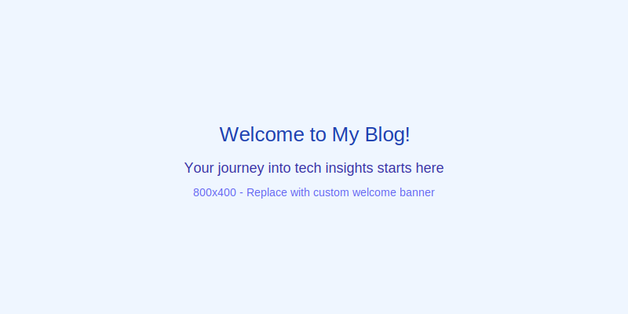

# Welcome to My Blog

This is my first blog post where I'll share insights about product management, community building, and the intersection of technology and human connection.

## What You Can Expect

- **Product Management Strategies**: Real-world insights from building successful products
- **Community Building**: How to foster authentic connections and engagement
- **Technology Trends**: Analysis of emerging technologies and their impact
- **Leadership Reflections**: Personal thoughts on effective leadership

## My Background

As a Product Manager and Community Builder, I've had the privilege of working with diverse teams and communities. This blog is where I'll share what I've learned, the challenges I've faced, and the solutions I've discovered.

## Let's Connect

I believe the best insights come from conversation and collaboration. Feel free to reach out if you'd like to discuss any of these topics further!

Stay tuned for more content coming soon.